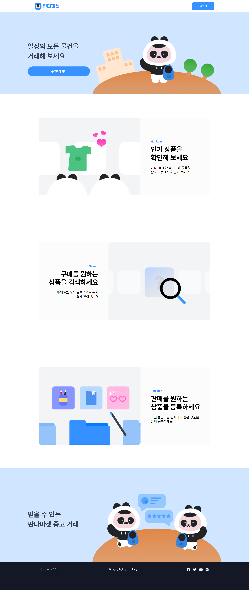
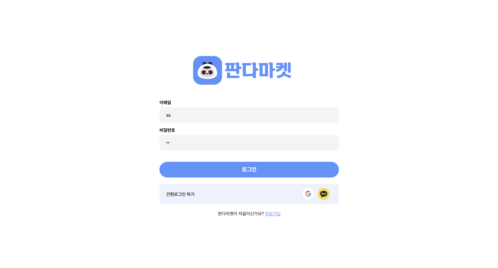
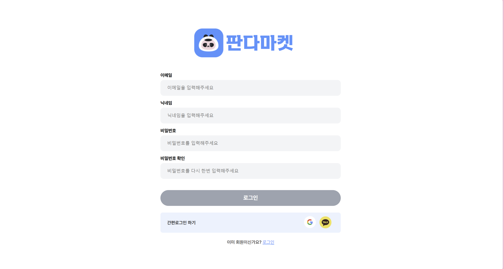

# Sprint Mission 1

## 요구사항

### 기본

랜딩 페이지

- [x] React와 같은 UI 라이브러리를 사용하지 않고 진행합니다
- [x] PC사이즈만 고려해 주어진 디자인으로 구현합니다.
- [x] HTML, CSS 파일을 Netlify로 배포해 주세요. (참고: https://www.codeit.kr/learn/5309)
- [x] 랜딩 페이지의 url path는 루트(‘/’)로 설정합니다.
- [x] title은 “판다마켓”로 설정합니다.
- [x] “판다마켓” 로고 클릭 시 루트 페이지(‘/’)로 이동합니다.
- [x] '로그인' 버튼 클릭 시 로그인 페이지(‘/login’)로 이동합니다 (빈 페이지)
- [x] “구경하러 가기”버튼 클릭 시(’/items’)로 이동합니다. (빈 페이지)
- [x] “Privacy Policy”, “FAQ”는 클릭 시 각각 Privacy 페이지(‘/privacy’), FAQ 페이지(‘/faq’)로 이동합니다.(모두 빈 페이지)
- [x] 페이스북, 트위터, 유튜브, 인스타그램 아이콘을 클릭 시 각각의 홈페이지로 새로운 창이 열리면서 이동합니다.
- [x] 아래로 스크롤해도 “판다 마켓” 로고와 “로그인” 버튼이 있는 상단 내비게이션 바(Global Navigation Bar)가 최상단에 고정되게 해 주세요.
- [x] 화면의 너비가 1920px 이상이면 하늘색 배경색은 너비를 꽉 채우도록 채워지고, 내부 요소들의 위치는 고정되고, 여백만 커지도록 합니다.
- [x] 화면의 너비가 1920px 보다 작아질 때, “판다마켓” 로고의 왼쪽 여백 200px, “로그인" 버튼의 오른쪽 여백 200px이 유지되고, 화면의 너비가 작아질수록 두 요소 간 거리가 가까워지도록 설정합니다.
- [x] 화면의 너비가 1920px 이상이면 내부에 있는 요소 간 동일한 간격을 유지하며 가운데 정렬해야 합니다.
- [x] 화면의 너비가 1920px 보다 작아질 때, 최하단에 있는 “codeit-2024”의 왼쪽 여백 200px과 SNS 아이콘들의 오른쪽 여백 200px을 유지하면서 가운데 있는 “Privacy Policy”, “FAQ” 요소와 각각 동일한 간격을 유지하며 가까워져야 합니다.
- [x] 클릭으로 기능이 동작해야 하는 경우, 사용자가 클릭할 수 있는 요소임을 알 수 있도록 CSS 속성 cursor: pointer로 설정합니다.

### 심화

공통

- [x] reset.css를 설정해 주세요.
- [x] 사용자의 브라우저 설정에 따라 기본 폰트 크기 설정이 변화함에 따라서 페이지의 요소 간 간격, 요소의 크기, font-size 등 모든 크기와 관련된 값이 크고 작아지도록 설정해 주세요.

## 주요 변경사항

-
-

## 스크린샷

## 멘토에게

-
-
- 셀프 코드 리뷰를 통해 질문 이어가겠습니다.

# Sprint Misssion 2

## 요구사항

### 기본

공통

- [x] README.md 파일을 작성해 주세요.
  - [x] 마크다운 언어를 숙지하여 작성해 주세요.
  - [x] 내용은 자유롭게 작성해 주세요.
- [x] 본인 브랜치(ex)part1-홍길동)에 스프린트 미션을 업로드해 주세요.
- [x] 적절한 커밋 메시지를 남겨 주세요.
- [x] 1-Sprint-Mission 레포지토리를 fork 합니다.
- [x] GitHub에 PR(Pull Request)을 생성해 upstream의 본인 브랜치(ex)part1-홍길동)에 미션을 제출합니다.
- [x] PR 코멘트에 아래 내용들을 포함해 주세요.
  - [x] 스프린트 미션 요구사항 체크리스트
    - [x] 아래 예시 사진과 같이 완료한 만큼 체크 표시를 해 주세요.
    - [x] 주요 변경사항
    - [x] 멘토님에게 남길 메시지
- [x] Git 활용 과정에서 유닉스 커맨드를 활용해 주세요.
- [x] HTML, CSS 파일을 Netlify로 배포합니다. (참고: https://www.codeit.kr/learn/5309)

로그인 페이지, 회원가입 페이지 공통

- [x] “판다마켓" 로고 클릭 시 루트 페이지(“/”)로 이동합니다.
- [x] 로그인 페이지, 회원가입 페이지 모두 로고 위 상단 여백이 동일합니다.
- [x] SNS 아이콘들은 클릭 시 각각 “https://www.google.com/”, “https://www.kakaocorp.com/page/” 으로 이동합니다.
- [x] input 요소에 focus in 일 때, 테두리 색상은 ##3692FF입니다.
- [x] input 요소에 focus out 일 때, 테두리는 없습니다.

로그인 페이지

- [x] “회원가입”버튼 클릭 시 “/signup” 페이지로 이동합니다.

회원가입 페이지

- [x] “로그인”버튼 클릭 시 “/login” 페이지로 이동합니다

### 심화

공통

- [x] palette에 있는 color값들을 css 변수로 등록해서 사용합니다.
- [x] 구글 애널리틱스로 방문자 수 확인하기 할 수 있도록 설정합니다.

로그인 페이지, 회원가입 페이지 공통

- [x] 비밀번호, 비밀번호 확인 input 요소 오른쪽에 비밀번호를 확인할 수 있는 눈 모양 아이콘을 추가합니다.

## 주요 변경사항

-
-

## 스크린샷

## 멘토에게

-
-
- 셀프 코드 리뷰를 통해 질문 이어가겠습니다.

## 기본 요구사항

### 공통

- [ ] Github에 스프린트 미션 PR을 만들어 주세요.

### 로그인, 회원가입 페이지 공통

- [ ] 로그인 및 회원가입 페이지의 이메일, 비밀번호, 비밀번호 확인 input에 필요한 유효성 검증 함수를 만들고 적용해 주세요.
- [ ] 이메일 input에서 focus out 할 때, 값이 없을 경우 input에 빨강색 테두리와 아래에 “이메일을 입력해주세요.” 빨강색 에러 메세지를 보입니다.
- [ ] 이메일 input에서 focus out 할 때, 이메일 형식에 맞지 않는 경우 input에 빨강색 테두리와 아래에 “잘못된 이메일 형식입니다” 빨강색 에러 메세지를 보입니다.
- [ ] 비밀번호 input에서 focus out 할 때, 값이 없을 경우 아래에 “비밀번호를 입력해주세요.” 에러 메세지를 보입니다
- [ ] 비밀번호 input에서 focus out 할 때, 값이 8자 미만일 경우 아래에 “비밀번호를 8자 이상 입력해주세요.” 에러 메세지를 보입니다.
- [ ] input 에 빈 값이 있거나 에러 메세지가 있으면 ‘로그인’ 버튼은 비활성화 됩니다.
- [ ] Input 에 유효한 값을 입력하면 ‘로그인' 버튼이 활성화 됩니다.
- [ ] 활성화된 ‘로그인’ 버튼을 누르면 “/items” 로 이동합니다

### 로그인 페이지

- [ ] 이메일과 비밀번호를 입력하고 로그인 버튼을 누른 후, 다음 조건을 참조하여 로그인 성공 여부를 alert 메시지로 출력합니다.
      만약 입력한 이메일이 데이터베이스(USER_DATA)에 없거나, 이메일은 일치하지만 비밀번호가 틀린 경우, '비밀번호가 일치하지 않습니다.'라는 메시지를 alert로 표시합니다
      만약 입력한 이메일이 데이터베이스에 존재하고, 비밀번호도 일치할 경우, “/items”로 이동합니다.

### 회원가입

- [ ] 회원가입을 위해 이메일, 닉네임, 비밀번호, 비밀번호 확인을 입력한 뒤, 회원가입 버튼을 클릭하세요. 그 후에는 다음 조건에 따라 회원가입 가능 여부를 alert로 알려주세요.
      입력한 이메일이 이미 데이터베이스(USER_DATA)에 존재하는 경우, '사용 중인 이메일입니다'라는 메시지를 alert로 표시합니다.
      입력한 이메일이 데이터베이스(USER_DATA)에 없는 경우, 회원가입이 성공적으로 처리되었으므로 로그인 페이지(”/login”)로 이동합니다.

## 심화 요구사항

### 공통

- [ ] 페이스북, 카카오톡, 디스코드, 트위터 등 SNS에서 판다마켓 랜딩 페이지(“/”) 공유 시 미리보기를 볼 수 있도록 랜딩 페이지 메타 태그를 설정합니다.
- [ ] 미리보기에서 제목은 “판다마켓”, 설명은 “일상에서 모든 물건을 거래해보세요”로 설정합니다.
- [ ] 주소와 이미지는 자유롭게 설정하세요.
- [ ] 로그인, 회원가입 페이지에 공통으로 사용하는 로직이 있다면, 반복하지 않고 공통된 로직을 모듈로 분리해 사용해 주세요.

### 랜딩 페이지

- [ ] 브라우저에 현재 보이는 화면의 영역(viewport) 너비를 기준으로 분기되는 반응형 디자인을 적용합니다. - PC: 1200px 이상 - Tablet: 744px 이상 ~ 1199px 이하 - Mobile: 375px 이상 ~ 743px 이하
      375px 미만 사이즈의 디자인은 고려하지 않습니다
- [ ] Tablet 사이즈로 작아질 때 최소 좌우 여백이 “판다마켓” 로고의 왼쪽에 여백 24px, “로그인” 버튼 오른쪽 여백 24px을 유지할 수 있도록 “판다마켓” 로고와 “로그인" 버튼의 간격이 가까워집니다.
- [ ] Mobile 사이즈로 작아질 때 최소 좌우 여백이 “판다마켓” 로고의 왼쪽에 여백 16px, “로그인” 버튼 오른쪽 여백 16px을 유지할 수 있도록 “판다마켓” 로고와 “로그인" 버튼의 간격이 가까워집니다.
- [ ] PC, Tablet 사이즈의 이미지 크기는 고정값을 사용합니다.
- [ ] Mobile 사이즈의 이미지는 좌우 여백 32px을 제외하고 이미지 영역이 꽉 차게 구현합니다. (이때 가로가 커지는 비율에 맞춰 세로도 커져야 합니다.)
- [ ] Mobile 사이즈 너비가 커지면, “Privacy Policy”, “FAQ”, “codeit-2023”이 있는 영역과 SNS 아이콘들이 있는 영역의 사이 간격이 커집니다.

### 로그인, 회원가입 페이지 공통

- [ ] Tablet 사이즈에서 내부 디자인은 PC사이즈와 동일합니다.
- [ ] Mobile 사이즈에서 좌우 여백 16px 제외하고 내부 요소들이 너비를 모두 차지합니다.
- [ ] Mobile 사이즈에서 내부 요소들의 너비는 기기의 너비가 커지는 만큼 커지지만 400px을 넘지 않습니다.
- [ ] 오류 메시지 모달을 구현합니다. 모달 내 내용은 alert 메시지와 동일합니다.
- [ ] 비밀번호 및 비밀번호 확인 입력란에 눈 모양 아이콘 클릭 시 비밀번호 표시/숨기기 토글이 가능합니다. 기본 상태는 비밀번호 숨김으로 설정합니다.

# 요구사항

## 기본 요구사항

### 공통

- [ ] Github에 스프린트 미션 PR을 만들어 주세요.

- [ ] 'https://sprint-mission-api.vercel.app/articles' API를 이용하여 아래 함수들을 구현해 주세요.

- [ ] getArticleList() : GET 메서드를 사용해 주세요.
- [ ] page, pageSize, keyword 쿼리 파라미터를 이용해 주세요.
- [ ] getArticle() : GET 메서드를 사용해 주세요.
- [ ] createArticle() : POST 메서드를 사용해 주세요.
- [ ] request body에 title, content, image 를 포함해 주세요.
- [ ] patchArticle() : PATCH 메서드를 사용해 주세요.
- [ ] deleteArticle() : DELETE 메서드를 사용해 주세요.
- [ ] fetch 혹은 axios 를 이용해 주세요.

- [ ] 응답의 상태 코드가 2XX가 아닐 경우, 에러메시지를 콘솔에 출력해 주세요.
- [ ] .then() 메서드를 이용하여 비동기 처리를 해주세요.

- [ ] .catch() 를 이용하여 오류 처리를 해주세요.

- [ ] 'https://sprint-mission-api.vercel.app/products' API를 이용하여 아래 함수들을 구현해 주세요.

- [ ] getProductList() : GET 메서드를 사용해 주세요.
- [ ] page, pageSize, keyword 쿼리 파라미터를 이용해 주세요.
- [ ] getProduct() : GET 메서드를 사용해 주세요.
- [ ] createProduct() : POST 메서드를 사용해 주세요.
- [ ] request body에 name, description, price, tags, images 를 포함해 주세요.
- [ ] patchProduct() : PATCH 메서드를 사용해 주세요.
- [ ] deleteProduct() : DELETE 메서드를 사용해 주세요.
- [ ] async/await 을 이용하여 비동기 처리를 해주세요.

- [ ] try/catch 를 이용하여 오류 처리를 해주세요.

- [ ] 구현한 함수들을 아래와 같이 파일을 분리해 주세요.

- [ ] export를 활용해 주세요.
- [ ] ProductService.js 파일 Product API 관련 함수들을 작성해 주세요.
- [ ] ArticleService.js 파일에 Article API 관련 함수들을 작성해 주세요.
- [ ] 이외의 코드들은 모두 main.js 파일에 작성해 주세요.

- [ ] import를 활용해 주세요.
- [ ] 각 함수를 실행하는 코드를 작성하고, 제대로 동작하는지 확인해 주세요.
